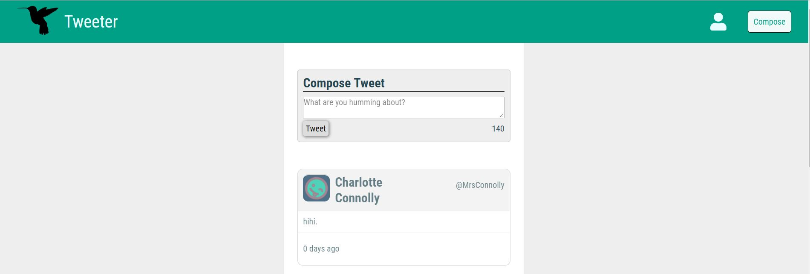
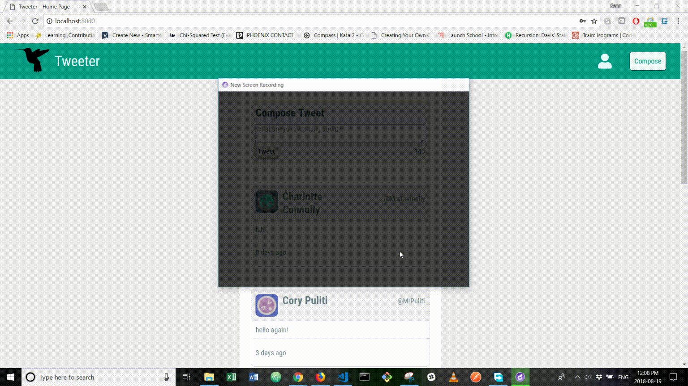
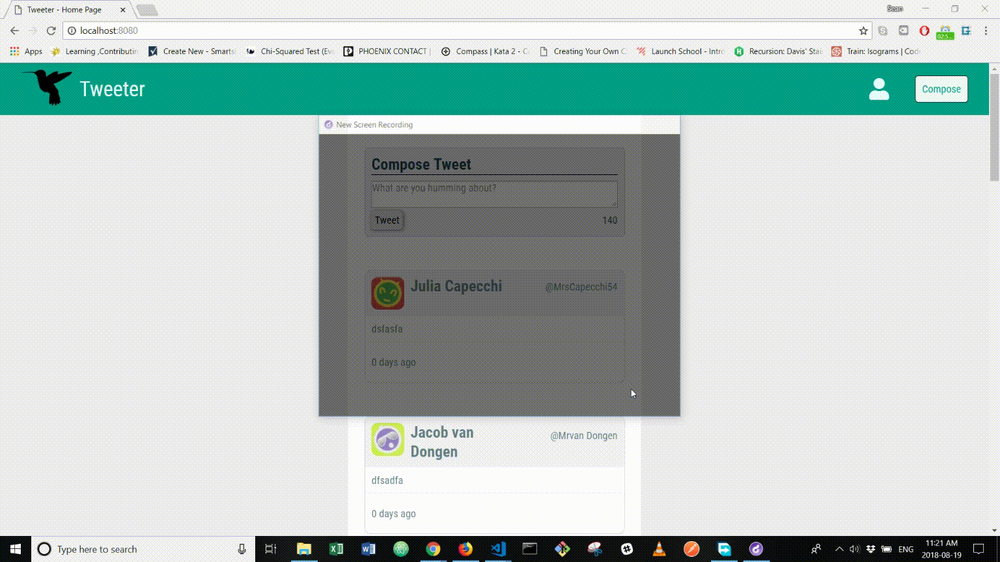
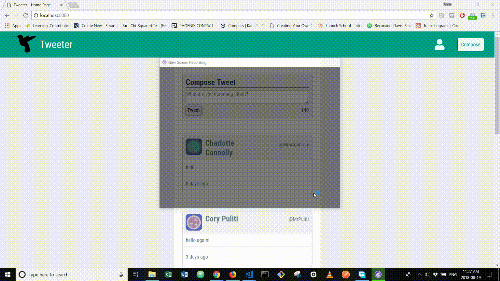

# Tweeter Project

## Dependencies

- Express
- Node 5.10.x or above

Tweeter is a simple, single-page Twitter clone.

## Final Product

### 1. Main Page

### 2. Adding Twitter

### 3. Toggle "Compose Twitter" Display

### 4. Hover over the Tweets for more functionalities

## Dependencies

- Node.js
- Express
- EJS
- bcrypt
- body-parser
- cookie-session
- chance
- md5
- mongodb
- cookie-parser
- cookie-session

## Getting Started

1. Fork this repository, then clone your fork of this repository.
2. Install dependencies using the `npm install` command.
3. Start the web server using the `npm start` command. The app will be served at <http://localhost:8080/>.
4. Start mongodb by using the `mongod` command
5. Go to <http://localhost:8080/> in your browser.
